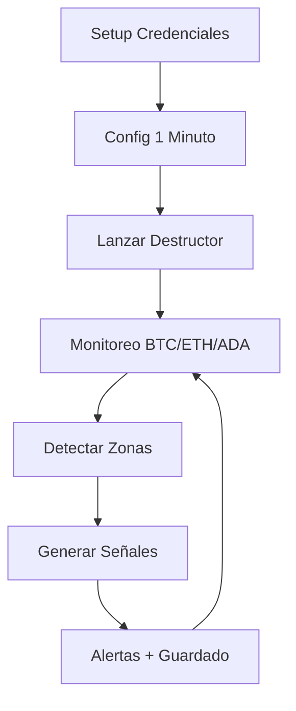

# 🚀⚔️ QUICK START - INICIO RÁPIDO ⚔️🚀

> *"Para comandantes espartanos que quieren destruir mercados YA"*

---

## 🔥 SETUP ULTRA-RÁPIDO (2 MINUTOS)

### 1️⃣ CONFIGURAR CREDENCIALES
```bash
python setup_binance_credentials.py
```

### 2️⃣ CONFIGURAR PARA 1 MINUTO
```bash
python config_1min_destroyer.py
```

### 3️⃣ ¡DESTRUIR MERCADOS!
```bash
./launch_1min_destroyer.sh
```

---

## 🎯 LO QUE VERÁS

### 🏛️ Detección de Zona
```
🔥⚔️ NUEVA ZONA DETECTADA - BTCUSDT ⚔️🔥
🏛️ Tipo: DEMAND
📍 POI: $43,245.67
📊 Rango: $43,189.45 - $43,301.89
⏰ Formación: 3 velas atrás
🕐 Hora UTC-5: 2024-01-15 14:23:45
```

### 🎯 Señal de Trading
```
🎯⚔️ SEÑAL DE TRADING ÉPICA - BTCUSDT ⚔️🎯
🔥 ACCIÓN: BUY
💰 ENTRADA: $43,301.89
🛡️ STOP LOSS: $43,172.34
🎯 TAKE PROFIT: $43,626.23
⚖️ RISK/REWARD: 2.5:1
🎲 CONFIANZA: 85%
🕐 HORA ENTRADA: 2024-01-15 14:24:45 (Ecuador)
```

---

## ⚙️ CONFIGURACIÓN 1 MINUTO

| Parámetro | BTC | ETH | ADA |
|-----------|-----|-----|-----|
| **Stop Loss** | 0.3% | 0.5% | 0.8% |
| **Take Profit** | 2.5x | 3.0x | 3.5x |
| **Risk/Reward** | 2.0:1 | 2.2:1 | 2.5:1 |
| **Confianza Mín** | 70% | 65% | 60% |

---

## 🛠️ TROUBLESHOOTING RÁPIDO

### ❌ "Credenciales no encontradas"
```bash
python setup_binance_credentials.py
source load_binance_env.sh
```

### ❌ "No se detectan zonas"
- ✅ Verifica conexión a internet
- ✅ Verifica credenciales de Binance
- ✅ Espera 1-2 minutos (el mercado debe moverse)

### ❌ "Error de conexión"
```bash
python test_real_detection.py
```

---

## 🚀 COMANDOS ÉPICOS

```bash
# Setup completo automático
python start_epic_destroyer.py

# Solo configurar credenciales
python setup_binance_credentials.py

# Solo configurar 1 minuto
python config_1min_destroyer.py

# Probar sistema
python test_real_detection.py

# Lanzar destructor
./launch_1min_destroyer.sh
```

---

## 📊 ARCHIVOS GENERADOS

```
signals/
├── trading_signals_2024-01-15.json    # Señales del día
└── ...

logs/
├── alerts_2024-01-15.json             # Log de alertas
└── ...

destroyer_1min_config.json             # Configuración 1min
load_binance_env.sh                     # Credenciales
launch_1min_destroyer.sh               # Lanzador rápido
```

---

## 🔥 ARCHIVOS A BORRAR MANUALMENTE

Si tienes errores, borra estos archivos:

1. **`demo/run_market_destroyer.py`** (versión con errores)
2. **`demo/zone_simulator.py`** (ya no se usa)
3. **Carpeta `backtesting/`** (creada por error)

Luego renombra:
- **`demo/run_market_destroyer_fixed.py`** → **`demo/run_market_destroyer.py`**

---

## 🎯 FLUJO COMPLETO



---

## 🏆 ¡LISTO PARA CONQUISTAR!

Una vez completado el setup:

1. 🔥 **Datos reales** de Binance
2. ⏰ **Timeframe 1 minuto** para máxima precisión
3. 🎯 **Señales automáticas** con SL/TP
4. 🕐 **Timestamps UTC-5** (Ecuador)
5. 💾 **Guardado automático** de todo
6. 🔊 **Alertas sonoras** épicas

**¡QUE COMIENCE LA DESTRUCCIÓN ÉPICA DE MERCADOS!** 🔥⚔️💀